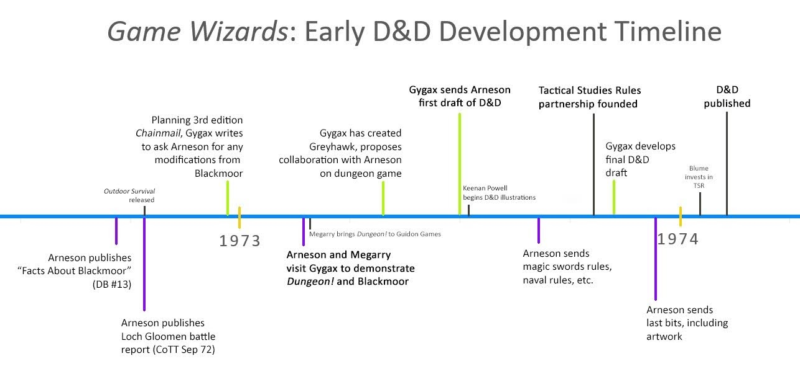
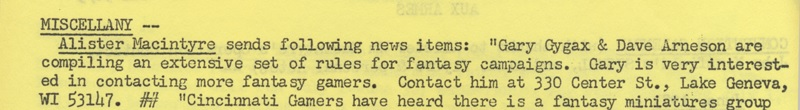

# Origin Dungeons & Dragons

Ce repository contient des articles et textes relatifs à ODD et à la création de ce jeu. La section `bibliothèque` contient quelques PDF significatifs glanés sur Internet et expliquant les origines de ODD.

Les documents présents dans la bibliothèque sont copiés pour une conservation historique. En effet, ils sont soit importants dans l'histoire des jeux, soit ce sont des commentaires importants qui méritent d'être conservés sur le long terme.

*Image from <http://playingattheworld.blogspot.com/2021/10/game-wizards-d-development-timeline.html>*

## 1972 : le Manuscrit Dalluhn

Dans les recherches sur les origines de ODD, les différents bloggueurs américains ont retrouvé, avec l'aide des premiers joueurs notamment du groupe de Dave Arneson, un manuscrit datant manifestement de 1972 dit *Manuscrit Dalluhn*, dont le titre est *Beyond This Point be Dragons* ou *BTPbD*.

Le titre du manuscrit est un clin d'œil à une indication qui figurait sur les cartes américaines depuis le XVIIIème siècle : *Here be Dragons*. Cette indication figurait sur les coins de la carte et indiquait que la carte ne couvrait pas les zones en question, et donc que ces zones pouvaient être potentiellement dangereuses.

## Forums

Les forums ci-dessous ont pour objet de discuter tout ce qui est relatif à ODD, ses origines mais aussi les règles qui sont, par moment, relativement obscures voire incohérentes.

* <https://odd74.proboards.com>

## Blogs

### Playing at the World

Un des blogs les plus intéressants sur l'origine de ODD. Dans la section bibliothèque, j'ai reproduit l'analyse détaillée de Jon Peterson sur le *Manuscrit Dalluhn*.

Le document PDF peut être trouvé ici : <https://playingattheworld.blogspot.com/2013/12/gary-gygaxs-1973-d-working-draft.html>.

Autres liens :

* Timeline de création du jeu avec annonce en juin 1973 pour trouver des joueurs : <http://playingattheworld.blogspot.com/2013/12/when-dungeons-dragons-turns-40.html>
* <http://playingattheworld.blogspot.com/2021/10/game-wizards-d-development-timeline.html>
* <https://deltasdnd.blogspot.com/2018/08/btpbd-missile-fire.html>
* <https://boggswood.blogspot.com/2012/05/beyond-this-point-be-dragons-d.html>
* <http://playingattheworld.blogspot.com/2017/07/the-dalluhn-manuscript-and-contax.html>

## Chainmail

* Une explication de Chainmail pour OD&D : <https://www.grey-elf.com/compleat-chainmail.pdf>

Certains points me laissent encore perplexe.

## Strategic Review

<https://archive.org/details/TheStrategicReviewDec1975>

## OD&D

### Reference sheets

<https://osr.smolderingwizard.com/downloads/odd/odd_ref_sheets.pdf>

### Swords and Spells

<https://www.drivethrurpg.com/product/17175/Swords--Spells-0e>

Rules for large-scale miniatures battles based on the game Dungeons & Dragons.

Product History

"Swords & Spells" (1976), by Gary Gygax with Dave Arneson & Rob Kuntz, is supplement for OD&D. It was published in August 1976.

Origins (I): A Fifth Supplement. "Swords & Spells" is the fifth supplement for OD&D, published in same format as "Supplement I: Greyhawk" (1974), "Supplement II: Blackmoor" (1975), "Supplement III: Eldritch Wizardry" (1976), and "Supplement IV: Gods, Demi-gods & Heroes" (1976). However, old-school fans are adamant: you shouldn't call it "Supplement V". Most notably, it doesn't have "Supplement V" marked on the cover; more generally, it's a complementary game that carries over OD&D ideas, not a supplement per se.

There are actually many contenders for the role of OD&D's Supplement V. "Swords & Spells" is the only one that was published by TSR in the appropriate era. Steve Marsh submitted a "'Greyhawk' style set of materials" including "monsters, character classes, [and] treasures". Meanwhile, Rob Kuntz submitted his own "Supplement V: Kalibruhn" which included poison rules, a new wizardly class, and more. Neither was accepted. Marsh kept corresponding with Gary Gygax afterward (and would even intern with TSR in the summer of 1980), but TSR employee Rob Kuntz would leave in 1977, primarily due to his inability to move over to the creative side of the company.

In more recent years, OSR fans have produced their own supplemental OD&D books, such as Geoffrey McKinney's Supplement V: Carcosa (2008), Robert Conley's Supplement VI: The Majestic Wilderlands (2009), Jason Vey's Supplement VI: Forbidden Lore (2009), Robert C. Pinnell's Supplement VII: Lost Lore (2012), and a few others that weren't numbered.

Origins (II): A Revised Chainmail. Tim Kask probably offers the most accurate description of "Swords & Spells" in the Foreword. He calls it the "grandson of Chainmail". OD&D (1974) was the son of Chainmail (1971): a fantasy roleplaying game that grew out of the "fantasy supplement" for Chainmail, and which quickly became its own game. "Swords & Spells" was the next step: a Chainmail-like game that derived from OD&D.

Origins (III): A Fantasy Supplements. "Swords & Spells" squared the circle in another way: whereas Chainmail was a medieval miniatures game with a fantasy supplement, "Swords & Spells" was fantasy to the core, as was reflected in its name. However, "Swords & Spells" didn't precisely match D&D's fantasy themes: it moved out of the dungeons that were at the time the core of D&D play and instead offered rules for battles in wilderness terrains.

The combination of nebulous fantasy with rigid miniatures rules was a somewhat uncomfortable one, as Kask revealed in his introduction where he said: "If something is unclear as to how or why it works that way, remember that it is all fantasy. Fantasy is not bound to rigid rules and rationales. Fantasy is imaginative."

Origins (IV): A Lost Cause. Given his background in miniatures, it seems likely that "Swords & Spells" was a dream project for Gygax. However, all the contradictions in the project suggest that it might have been doomed from the start. Where OD&D found innovation by moving to a man-to-man scale and exploring dungeons, "Swords & Spells" moved back to an strategic scale (1:10) and traveled above the ground. It seems likely these contradictions were based on a disconnect between the wargamers who ran TSR and the young, new players who were flocking to D&D.

But, "Swords & Spells" also ran right into the face of TSR's next big thing. Not only was OD&D on it way out, but the new AD&D system (1977-1979) would directly contradict Kask's suggestions here that GMs could do as they pleased. This change from OD&D to AD&D would largely doom "Swords & Spells", though there is a single reference to it in the AD&D Dungeon Masters Guide (1979) section on charging rules.

Otherwise, "Swords & Spells" faded quickly, and is today one of the least remembered supplements from TSR's early period of publication. Mind you, it was still successful enough at the time. It ran through at least six printings, and like the whole OD&D line was kept in print at least through the end of the '70s. It also had clear successors, as the grognards of TSR tried again and again to match their fantasy roleplaying game with more classic wargaming systems. Battlesystem (1985) would be the next one to follow at this army-level scale.

Expanding D&D. "Swords & Spells" is a new mass-combat system that's compatible with D&D. Along the way, it rather surprisingly adds some content that was missing from OD&D.

One of the biggest additions is a massive spell chart, which runs from page 12-15. Not only is it the most comprehensive spell list for the OD&D game (minus a few spells like read magic and read languages that weren't useful for mass-combat), but it also includes some data that was missing from the OD&D game itself … like a duration for Sleep!

Another big addition is (surprisingly) a turn sequence, which carefully lays out when bow fire, movement, missile fire, and melee occurs. Finally, "Swords & Spells" adds the idea of readying spells, as spells have to be prepared on rounds before they're cast. Turn sequences of course made their way into the much more comprehensive AD&D rules, but the idea of readying spells was never heard from again.

Expanding Chainmail. Otherwise, "Swords & Spells" is a clear descendent of "Chainmail", with some sections such as movements and formations looking like they were wholesale copied from the original. The biggest change from "Chainmail" is that "Sword & Spells" has diceless combat resolution.

Casualties are determined by cross-referencing damage, level (or HD), and AC, multiplied by the number of units. As the rules says, "Once the appropriate base damage is determined, simply cross index the level of attacker against the armor class of the defender to find the number of hit points of damage scored upon the defender." Units are then destroyed when they take their average hit points in damage.

This diceless combat resolution was considered quite innovative, as was the fact that the game mixes the normal 1:10 scale units with 1:1 scale D&D characters.

About the Creators. Gygax was of course the co-creator of the OD&D game. This was his final major contribution to OD&D, but he'd soon be working on the AD&D books (1977-1979).

About the Product Historian

The history of this product was researched and written by Shannon Appelcline, the editor-in-chief of RPGnet and the author of Designers & Dragons - a history of the roleplaying industry told one company at a time. Please feel free to mail corrections, comments, and additions to shannon.appelcline@gmail.com. Thanks to the Acaeum for careful research on Monster Manual printings.

